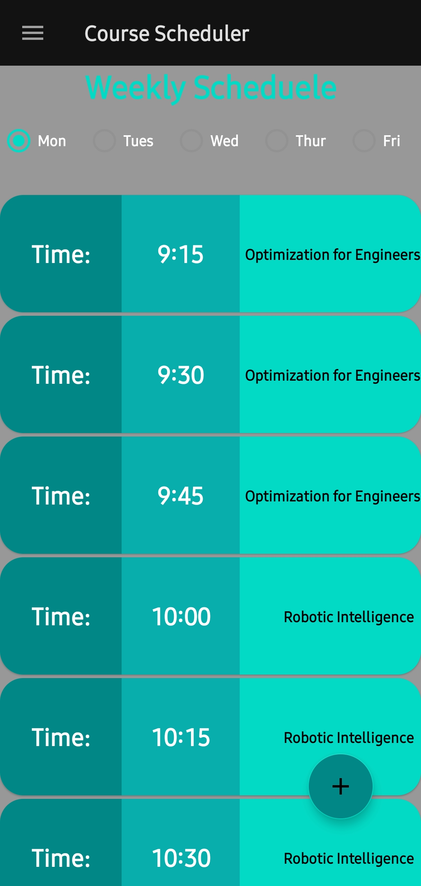
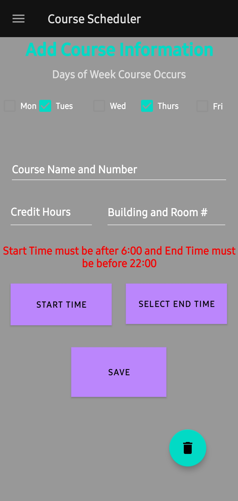
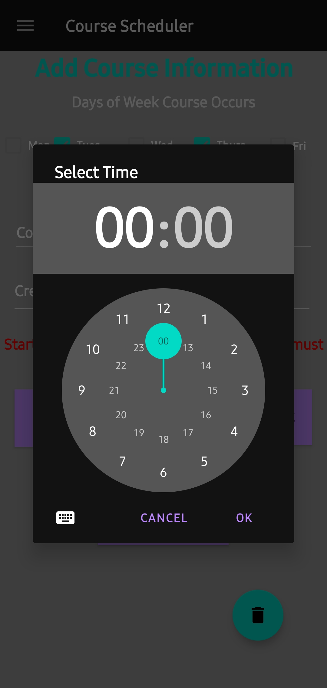
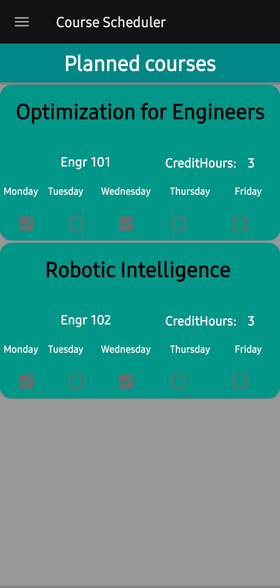
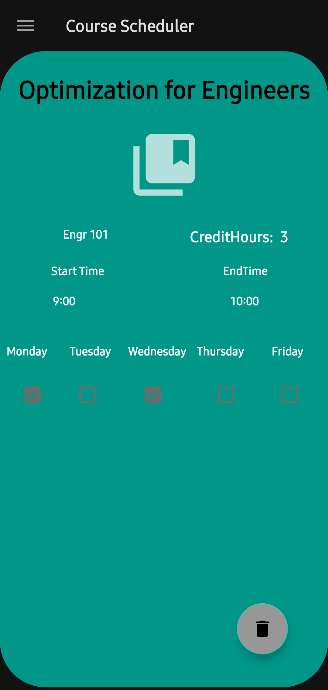

# My App

## Description

* This app was made for a final project in my Graphical User interfaces class
  * This was made with the View - ViewModel Model - Design Pattern
  * It is a Course Scheduler App that allows users to enter Course Information includes Course Name and Credit Hours and Course Time
  * This app contains two SQL tables.
    * One contains all course information
    * The other contains all times for monday through friday.
* When information is entered the second table is checked to verify if there are any time conflicts and displays an error if there is.

## ScreenShots

* 
* 
* 
* 
* 
